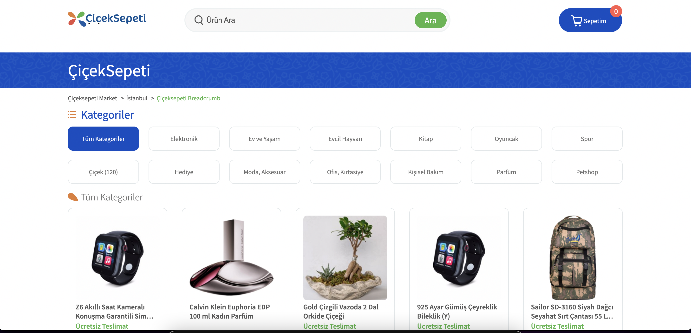

# ÇİÇEK SEPETİ

## Deployment

* https://ciceksepet-case.vercel.app/

## Goals

- [x] Responsive Design
- [x] Searching Products
- [x] Filtering Products
- [x] Cart Button Functionality

## Tech stack

* [React](https://en.reactjs.org/)
* [SASS](https://sass-lang.com/)
* [Axios](https://axios-http.com/docs/intro)

## Setup

Clone project to your computer `git clone https://github.com/baristunar/ciceksepet-case` 

Install dependencies `yarn install`

Starting local server `yarn start`

Build `yarn build`

## Contact me

- <a href="mailto:tunarbaris7@gmail.com">Email</a>
- [Twitter](https://twitter.com/baristunar)
- [Linkedin](https://www.linkedin.com/in/baristunar/)
- [Github](https://github.com/baristunar)